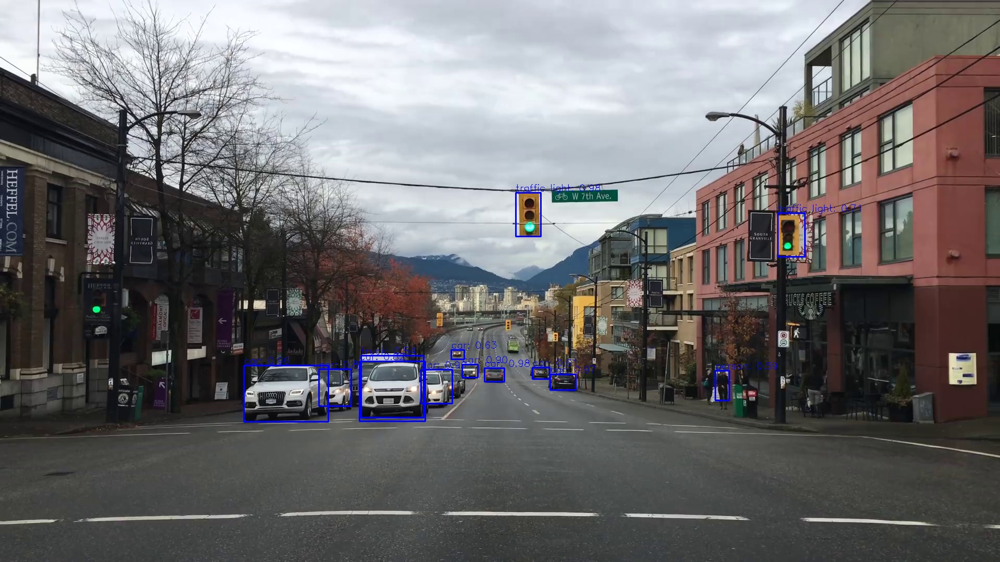

# YOLOv3 (You Only Look Once)

Tensorflow implementation of Yolo object detection model.

* train.py - Yolo training script
* video.py - Video object detection
* weights.py - Convert Yolo trained weights to TF format.

